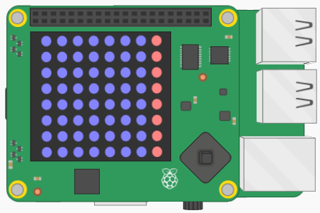

## Generating pipes.

In flappy astronaut the astronaut will have to avoid "pipes" that sprout from the top and bottom of the matrix. The pipes are going to be red in colour.

- To begin, you can first create a single column of red pixels on the far, right hand-side of the matrix.

	

- All you need to do is to set the last item in each of the lists within the matrix to be `RED` instead of `BLUE`. Below is a refresher of how to access items in a 

[[[generic-python-list-index]]]

- To do this, you can use a `for` loop, so that for each list in the matrix, the last item in the list is set to `RED`. Position this for loop so that it occurs before you flatten and display the matrix. You can use the hints below to help you out if you need them.

--- hints --- --- hint ---
- Here is an example of what your code should look like, with some comments added in for where your `for` loop would go.
```python
from sense_hat import SenseHat

sense = SenseHat()
RED = (255, 0, 0)
BLUE = (0, 0, 255)

matrix = [[BLUE for column in range(8)] for row in range(8)]

def flatten(matrix):
    flattened = [pixel for row in matrix for pixel in row]
    return flattened

## Place your for loop here

matrix = gen_pipes(matrix)    
matrix = flatten(matrix)
sense.set_pixels(matrix)
```
--- /hint --- --- hint ---
- Your `for` loop should iterate over the lists inside the matrix.
```python
for row in matrix:
```
--- /hint --- --- hint ---
- Then you set the last item in each list to `RED`
```python
for row in matrix:
    row[-1] = RED
```
- Here's what it should do:
<iframe src="https://trinket.io/embed/python/55875860f1" width="100%" height="600" frameborder="0" marginwidth="0" marginheight="0" allowfullscreen></iframe>
--- /hint --- --- /hints ---
