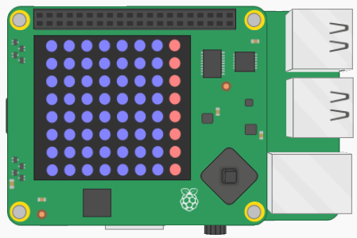

## Generating pipes

In Flappy Astronaut, the astronaut will have to avoid 'pipes' that sprout from the top and bottom of the matrix. The colour of the pipes is going to be red.

To begin, you can create a single column of red pixels on the right-hand side of the matrix.



All you need to do is to set the last item in each of the lists within the matrix to be `RED` instead of `BLUE`. Below is a refresher of how to access items in a list.

[[[generic-python-list-index]]]

- You can use a for loop so that, for each list in the matrix, the last item is set to `RED`. Position this for loop so that it runs before you flatten and display the matrix. You can use the hints below to help you out if you need them.

--- hints ---
--- hint ---
- Then you set the last item in each list to `RED`.
	```python
	for row in matrix:
		row[-1] = RED
	```
- Here's what it should do:
<iframe src="https://trinket.io/embed/python/55875860f1" width="100%" height="600" frameborder="0" marginwidth="0" marginheight="0" allowfullscreen></iframe>
--- /hint ---
--- /hints ---

