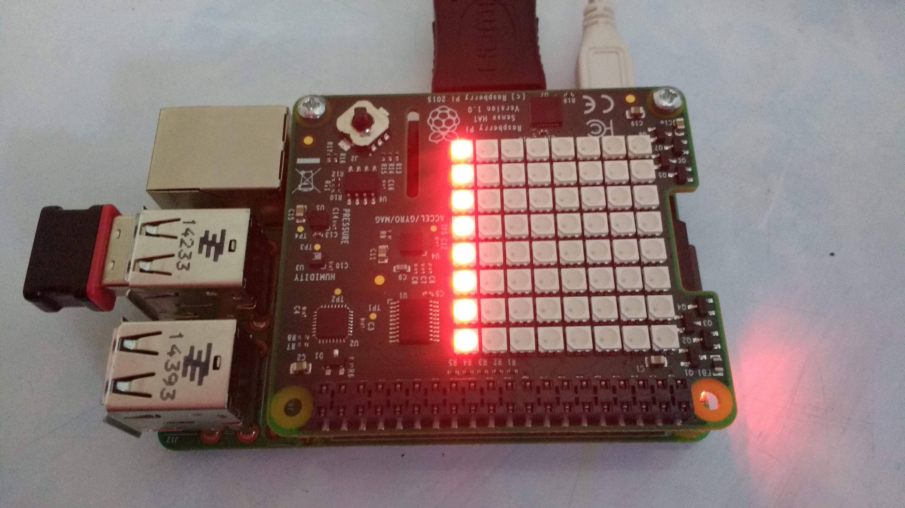

## Multiple columns

- Now that you have a single column, you can make it move across the LED matrix.

- Currently the column starts on the far right of the matrix, at position `x = 7`. So to make it move, you need to use this simple algorithm.
  1. Draw a column at `x = 7` with colour red
  2. Wait half a second
  3. Draw a colum at `x = 7` with colour black
  4. Draw a column at `x = 6` with colour red
  5. Keep doing this until `x = 0`
  
- You already have code that does the first part. To do the second step, you'll need to import the `sleep` method from the `time` module. Add this line to the top of your code, where you imported the `sense_hat` module.

```python
from time import sleep
```

- 
- You can start by drawing the columns that will scroll across the LED matrix. You're going to use some loops in this game, so you'll need a way to bring the loops to a close. To achieve this, you can use a **global variable** called `game_over` to keep track of whether the game is being played or has ended.

    ```python
	## GLOBALS
	game_over = False
	```

- To begin with, you will make a vertical line of LEDs that scroll across the screen. This can be produced using a function called `draw_column`. The function will need to be able to change the `game_over` variable, so within the function you need to set it as a global variable.

	```python
	def draw_column():
		global game_over
	```

- The column is going to start on the far right of the matrix. If you look a the diagram below, you can see that this means it will have a position on the `x` axis of 7.

- Set the starting position of the column, in the `draw_column` function.

	```python
	def draw_column():
		global game_over
		x = 7
	```

- Now you need to illuminate the last column of LEDs, pause for a little bit, turn off the column of LEDs and then illuminate the next column along, by reducing the value of `x` by one. This can all be done within a `while` loop, which keeps looping until the value of x gets to 0 or the game is over.

	```python
	def draw_column():
		global game_over
		x = 7
		while x >= 0 and not game_over:
	```

- The column of LEDs is going to be red. To switch them off, we can change them to black. You need to specify these variables in your `##Globals` section.

	```python
	##Globals
	game_over = False
	RED = (255,0,0)
	BLACK = (0,0,0)
	```

- To illuminate all the pixels in a given column, you could write something like `sense.set_pixel(x,0,RED)` eight times, changing the 0 to 1, then 2, then 3, etc. However, this is simpler to do in a `for` loop.

	```python
	def draw_column():
		global game_over
		x = 7
		while x >= 0 and not game_over:
			for led in range(8):
				sense.set_pixel(x,led,RED)
	```

- To test that the function is working, it needs to be **called**. You can temporarily add in a function call to the bottom of your script or you could type `draw_column()` in the IDLE shell, after saving and running your script (`ctrl+s` and `F5`).



<iframe src="https://trinket.io/embed/python/dfd655bfbb" width="100%" height="600" frameborder="0" marginwidth="0" marginheight="0" allowfullscreen></iframe>

