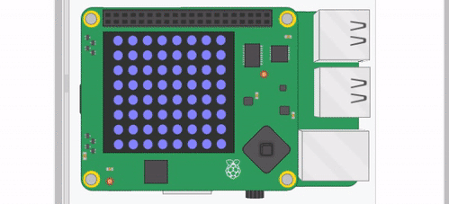

## Moving pipes algorithm

Now that you can generate as many pipes as you want, you need to move them across the matrix so that they proceed towards the left of the matrix.

It might be easier to picture this on a smaller scale. For instance, here's a 5x5 matrix

	```
	  0 1 2 3 4
	0 b b b b r
	1 b b b b r
	2 b b b b b
	3 b b b b r
	4 b b b b r
	```
To move the red pixels (`r`) to the left, then you can follow a simple algorithm.
  1. Move all the items at index `1` in each of the rows to index `0`
  1. Move all the items at index `2` in each of the tows to index `1`
  1. Move all the items at index `3` in each of the tows to index `2`
  1. Move all the items at index `4` in each of the tows to index `3`
  1. Fill all the items at index `5` in each row with a `b`

This would then give you a matrix that looked like this.

	```
	  0 1 2 3 4
	0 b b b r b
	1 b b b r b
	2 b b b b b
	3 b b b r b
	4 b b b r b
	```
You could then run the alogrithm again to repeat the movement to give you this.

	```
	  0 1 2 3 4
	0 b b r b b
	1 b b r b g
	2 b b b b b
	3 b b r b b
	4 b b r b b
	```
If you did this with your matrix then you would get the following happening.


