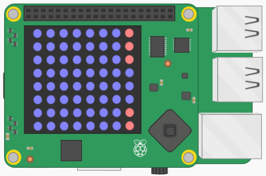

## Cuidado con las aberturas

Ahora que tienes una columna de píxeles que representa una tubería en el lado derecho de la matriz, necesitas insertar una abertura a través del cual el astronauta pueda volar.

La abertura necesita ser de tres píxeles de altura, y debe colocarse al azar en la columna de píxeles rojos.



Querrás que el hueco de tres píxeles se centre en una de las filas entre `1` y `6` (inclusivo). Puedes usar el módulo `random` para conseguir esto:

[[[generic-python-random]]]

- Esto es lo que necesitas hacer:
  1. Importa el método `randint` en la parte superior de tu código
  1. Después de que el ciclo for haya terminado, crea una variable llamada `abertura`, y asigna un número aleatorio entre `1` y `6` como su valor
  1. Cambia el último píxel en esa fila de la matriz a `AZUL`
  1. Cambia el último píxel de la fila `abertura - 1` a `AZUL`
  1. Cambia el último píxel de la fila `abertura + 1` a `AZUL`

--- hints ---
 --- hint ---

- El método que necesitas importar es el método `randint`.
```python
from random import randint
```
--- /hint --- 

--- hint ---
- Después del ciclo for, elige un valor aleatorio para `abertura`.
```python
for fila in matriz:
    fila[-1] = ROJO
abertura = randint(1,6)
```
--- /hint --- 

--- hint ---
- Ahora, configura los píxeles en la última columna de cada una de las filas numeradas `abertura`, `abertura + 1`, y `abertura - 1`.
```python
for fila in matriz:
    fila[-1] = ROJO
abertura = randint(1, 6)
matriz[abertura][-1] = AZUL
matriz[abertura - 1][-1] = AZUL
matriz[abertura + 1][+1] = AZUL
```
- Así es como debería verse: 
<iframe src="https://trinket.io/embed/python/29cd037f5f" width="100%" height="600" frameborder="0" marginwidth="0" marginheight="0" allowfullscreen mark="crwd-mark"></iframe> 
--- /hint --- --- /hints ---
