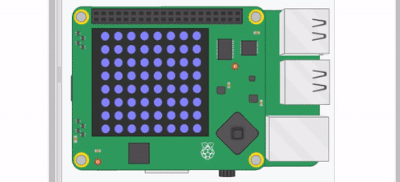

## Algoritmo de tuberías móviles

Ahora que puedes generar tantas tuberías como quieras, necesitas moverlas a través de la matriz para que continúen hacia la izquierda de la pantalla.

Podría ser más fácil imaginar esto a una escala menor. Por ejemplo, aquí hay una matriz 5×5:

```
  0 1 2 3 4
0 a a a a r
1 a a a a r
2 a a a a a
3 a a a a r
4 a a a a r
```
Para mover los píxeles rojos (`r`) a la izquierda, puedes seguir un simple algoritmo:
  1. Mueve todos los elementos en el índice `1` en cada una de las filas al índice `0`
  1. Mueve todos los elementos en el índice `2` en cada una de las filas al índice `1`
  1. Mueve todos los elementos en el índice `3` en cada una de las filas al índice `2`
  1. Mueve todos los elementos en el índice `4` en cada una de las filas al índice `3`
  1. Rellena todos los elementos en el índice `5` en cada fila con una `a`

Esto entonces te daría una matriz que se ve así:

```
  0 1 2 3 4
0 a a a r a
1 a a a r a
2 a a a a a
3 a a a r a
4 a a a r a
```
Puedes ejecutar el algoritmo nuevamente para repetir el movimiento, lo que te daría esto:

```
  0 1 2 3 4
0 a a r a a
1 a a r a a
2 a a a a a
3 a a r a a
4 a a r a a
```
Si haces esto con tu matriz, entonces sucederá lo siguiente:


