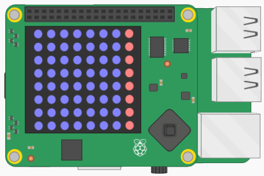

## Buizen genereren

In Flappy Astronaut moet de astronaut 'buizen' vermijden die uit de boven- en onderkant van de matrix ontspruiten. De kleur van de buizen wordt rood.

Om te beginnen kun je een enkele kolom met rode pixels aan de rechterkant van de matrix maken.



Het enige wat je hoeft te doen is om het laatste item in elk van de lijsten in de matrix in te stellen op `RED` plaats van `BLUE`. Hieronder vindt je een opfriscursus voor toegang tot items in een lijst.

[[[generic-python-list-index]]]

- Je kunt een for-lus gebruiken, zodat voor elke lijst in de matrix het laatste item wordt ingesteld op `RED`. Plaats deze voor de lus zodat deze wordt uitgevoerd voordat je de schijf afvlakt en de matrix weergeeft. Je kunt de onderstaande tips gebruiken om je te helpen als je ze nodig hebt.

--- hints --- --- hint ---
- Hier is een voorbeeld van hoe jouw code eruit zou moeten zien, met enkele opmerkingen toegevoegd waar jouw for-lus zou moeten komen.
    ```python
    from sense_hat import SenseHat

    sense = SenseHat()
    ROOD = (255, 0, 0)
    BLAUW = (0, 0, 255)

    matrix = [[BLAUW for column in range(8)] for row in range(8)]

    def afvlakken(matrix):
     afgevlakt = [pixel for row in matrix for pixel in row]
      return afgevlakt


    ## Plaats jouw for lus hier

    matrix = afvlakken(matrix)
    sense.set_pixels(matrix)
    ```
--- /hint ---
--- hint ---
- Je for-lus moet door de lijsten in de matrix lopen.
    ```python
    for row in matrix:
    ```
--- /hint ---
--- hint ---
- Vervolgens stel je het laatste item in elke lijst in op `ROOD`.
    ```python
    for row in matrix:
        row[-1] = ROOD
    ```
- Dit is wat het zou moeten doen: 

<iframe src="https://trinket.io/embed/python/55875860f1" width="100%" height="600" frameborder="0" marginwidth="0" marginheight="0" allowfullscreen mark="crwd-mark"></iframe> 

--- /hint --- --- /hints ---
