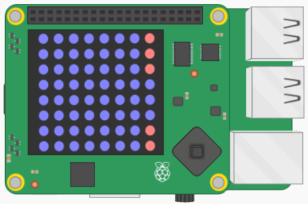

## Let op de gaten

Nu je een kolom met pixels hebt die een buis aan de rechterkant van de matrix vertegenwoordigt, moet je er een opening in invoegen waardoor de astronaut kan vliegen.

De opening moet drie pixels hoog zijn en moet willekeurig in de kolom met rode pixels worden geplaatst.



Je wilt dat de opening van drie pixels hoog wordt gecentreerd rond een van de rijen tussen `1` en `6` (inclusief). Je kunt de `willekeurige` module gebruiken om dit te bereiken:

[[[generic-python-random]]]

- Dit is wat je moet doen:
  1. Importeer de `randint` methode bovenaan uw code
  1. Nadat de for-lus is beëindigd, maak je een variabele met de naam `gap`en wijs je een willekeurig getal tussen `1` en `6` als waarde
  1. Wijzig de laatste pixel in die rij van de matrix in `BLAUW`
  1. Verander de laatste pixel in rij `opening - 1` naar `BLAUW`
  1. Wijzig de laatste pixel in rij `kloof + 1` naar `BLAUW`

--- hints --- --- hint ---
- De methode die u moet importeren is de `randint` methode.
```python
from random import randint
```
--- /hint ---
--- hint ---
- Kies na de for-lus een willekeurige waarde voor `opening`.
```python
for row in matrix:
    row[-1] = ROOD
tussenruimte = randint(1, 6)
```
--- /hint ---
--- hint ---
- Stel nu de pixels in de laatste kolom van elk van de rijen met nummer `tussenruimte`, `tussenruimte + 1`en `tussenruimte -1`.
```python
for row in matrix:
    row[-1] = ROOD
tussenruimte = randint(1, 6)
matrix[tussenruimte][-1] = BLAUW
matrix[tussenruimte - 1][-1] = BLAUW
matrix[tussenruimte + 1][+1] = BLAUW
```
- Zo zou het eruit moeten zien: 

<iframe src="https://trinket.io/embed/python/37ee188eb5" width="100%" height="600" frameborder="0" marginwidth="0" marginheight="0" allowfullscreen mark="crwd-mark"></iframe> 

--- /hint --- --- /hints ---
